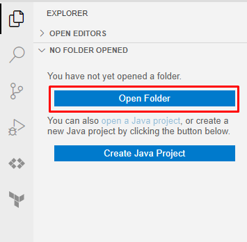

# Prérequis

## Compte Google Cloud

Pour réaliser ce tutoriel, nous utiliserons Cloud Shell Editor, qui est un service de Google Cloud.
Si vous n'avez pas de compte Google Cloud, il sera nécessaire d'en créer un. Vous pouvez le faire sur la page suivante:
https://console.cloud.google.com/freetrial

> Lors de la création du compte, vous devrez fournir un numéro de carte de crédit,
> mais le tutoriel ne dépassera pas l'offre gratuite.

> Il est aussi possible d'utiliser son environnement de développement local.
> Toutefois, les énoncés et corrigés n'ont été testés que sur Cloud Shell Editor.
> Si vous décidez d'utiliser votre environnement local, il faudra adapter le contenu des exercices en autonomie.

## Cloud Shell Editor

Cloud Shell Editor est un VSCode accessible en ligne.

Pour l'ouvrir, il suffit de se rendre sur la page suivante:
https://ssh.cloud.google.com/cloudshell/editor

Il faudra aussi veiller à ce que le mode éphémère soit désactivé.
Lorsque le mode éphémère est activé, la mention "Éphémère" apparaît en haut à gauche de l'écran.


## Exécution du script d'initialisation

Dans un terminal, exécuter les commandes suivantes pour initialiser l'environnement de travail:
```bash
git clone https://github.com/bnau/dvc-project
cd dvc-project

export PATH=$PATH:~/.local/bin
pip install dvc dvc[gs] ipykernel matplotlib fastapi uvicorn python-multipart
```

> On peut accéder à un terminal en cliquant sur le bouton dédié en haut à droite de l'écran.


## Ouverture du projet dans Cloud Shell Editor

Il vous faudra enfin ouvrir le projet dans Cloud Shell Editor.


/!\ **Important** /!\ 
> Vous pouvez maintenant suivre le hands-on.
> Chaque partie (sauf la première) commencera par une étape d'initialisation.
> Ces étapes sont facultatives.
> Elles permettent de reprendre à partir du corrigé de l'étape précédente
> mais il est préférable de réaliser l'intégralité des exercices.


Un collègue a écrit un petit script pour générer un réseau de neurones qui classifie des images de chats ou de chiens.
Vous venez d'intégrer son équipe et vous devez maintenant monter votre environnement de développement.

Le Notebook de votre collègue est disponible dans le projet Github suivant:

https://github.com/bnau/dvc-project

> Pas besoin de cloner le repo Git en local. On va plutôt utiliser Cloud Shell Editor tout au long de ce Hands-on. 

Comme tout réseau de neurones a besoin de données pour s'entraîner,
et qu'on ne va pas mettre de fichiers volumineux dans Git,
vous allez devoir télécharger les données d'entraînement à un autre endroit.

https://storage.googleapis.com/dvc-input-dependencies-hands-on/data.zip

Le réseau de neurones n'a pas été entraîné from scratch.
Il ajoute quelques couches de neurones à un réseau pré-entraîné.

Vous allez aussi devoir télécharger le modèle pré-entraîné:

https://storage.googleapis.com/dvc-input-dependencies-hands-on/base.h5

> Ce hands-on aura pour but de transformer un projet existant pour tendre vers une architecture GitOps.
> Chaque étape sera décrite dans un fichier Markdown.
> Au début de chaque étape, vous trouverez un lien vers un Cloud Shell Editor pré-configuré pour cette étape.
> À part pour la première étape, le lien est facultatif. Il permet de reprendre à partir du corrigé de l'étape précédente.
