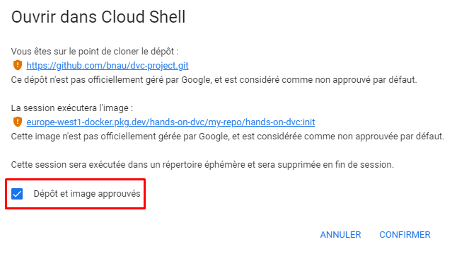
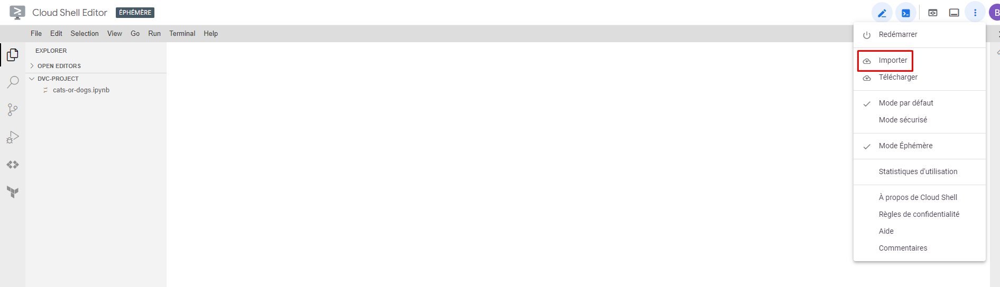
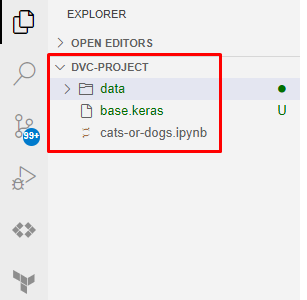
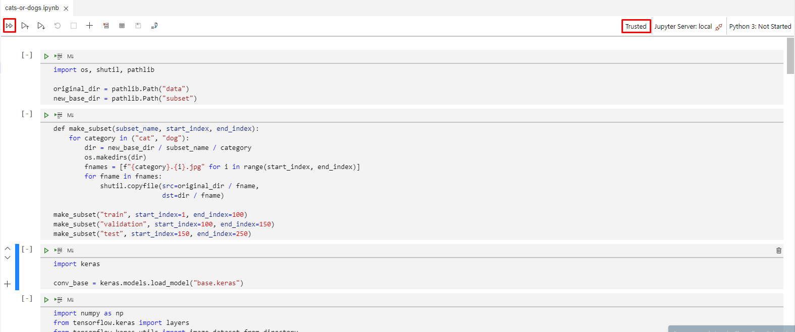

# Premières étapes

* Manipulation de Cloud Shell Editor
* Ajout manuel des fichiers de données et du modèle pré-entraîné
* Génération du premier réseau de neurones

## Contexte

Dans ce hands-on, nous allons nous mettre dans la peau d'un Data Scientist qui souhaite
reprendre un projet de classification d'images de chiens et de chats.
Il s'agira d'un fine tuning d'un modèle pré-entraîné.
On commencera par exécuter un Jupyter Notebook en configurant manuellement l'accès à la donnée
et on industrialisera progressivement le projet en utilisant DVC.

> Il n'y a pas besoin d'avoir des connaissances poussées en Machine Learning.
> Le hands-on se concentre sur la partie industrialisatio.

## Initialisation de l'environnement de travail

Accéder à l'environnement de travail préconfiguré par ce [lien](https://shell.cloud.google.com/cloudshell/editor?ephemeral=false).

> Transmettre l'adresse mail du compte Google utilisé à l'organisateur.
> Se créer un compte Google si nécessaire.

Bien penser à approuver le dépôt et l'image.



L'environnement de travail contient un clone du repository Git du projet à reproduire.
L'ensemble des outils à utiliser sont déjà installés.

## Téléchargement des données et du modèle pré-entraîné

Une fois Cloud Shell Editor ouvert, importer les fichiers `data.zip` et `base.h5` précédemment téléchargés
dans le même dossier que le Notebook `cats-or-dogs.ipynb`.



Penser à dézipper le fichier `data.zip`.

```bash
unzip data.zip
rm data.zip
```

La structure cible du file system doit être la suivante:


## Génération du réseau de neurones

Ouvrir le fichier `cats-or-dogs.ipynb` et exécuter toutes les cellules.


Plusieurs fichiers ont été générés, dont le modèle entraîné `model.keras`.

## À retenir

* On a pu reproduire le code du projet.
* Un réseau de neurones similaire a été généré.

Cependant, on a du effectuer des actions manuelles (importation des données et du modèle pré-entraîné)...

## Next

Prochaine étape: [Surveillons les fichers](02.track_files.md)