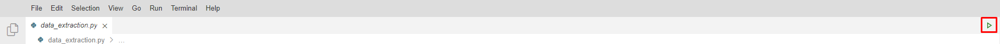

# Découpage en étapes d'exécution

## Agenda

Durant cette étape, nous allons allons préparer le terrain pour découper les étapes suivantes.

Nous allons reprendre le contenu du Jupyter Notebook et le découper en plusieurs scripts Python.

## Initialisation de l'environnement de travail (facultatif)

Récupérons ce qui a été généré à l'étape précédente:

```bash
git checkout chapter03
wget https://storage.googleapis.com/dvc-input-dependencies-hands-on/prerequisites/chapter03.zip
unzip chapter03.zip
rm chapter03.zip

dvc remote add -d default gs://dvc-remote-storage-hands-on-${USER}
dvc push
```

## Découpage du Jupyter Notebook

Regardons plus en détail le contenu du Jupyter Notebook.

Il est constitué de quatre étapes :
* Data extraction: cette étape consiste à prendre les images de chiens et de chats présents dans le dossier `data`
et à les catégoriser en chien/chat et à les séparer en données d'entraînement, de validation ou de test. 
Le résultat de cette étape sera présent dans le dossier `subset`.
* Data preprocessing: dans cette étape, on normalise les images du dossier `subset` et on en récupère 
la prédiction faite par le modèle de base. Les résultats sont exportés sous la forme de tableau Numpy dans le dossier `preprocessed`.
* Training: Ici, on entraîne un modèle composé de quelques couches de neurones.
Il s'agit des couches qu'on ajoutera au modèle de base. Le modèle de base est entraîné pour de la reconnaissance d'image. 
Les couches qu'on rajoute sont spécifiques à la classification de chiens et de chats. Le modèle custom est sauvegardé dans le fichier `model.h5`.
* Evaluation: enfin, on évalue l'accuracy du modèle à partir des données de test.

Il suffira de remplacer le Notebook par quatre fichiers: `data_extraction.py`, `data_preprocessing.py`, `train.py` et `evaluate.py`.

Pour vérifier le fonctionnement d'un script, on peut utiliser la commande `python FILENAME.py` ou l'interface graphique. 


## À retenir

Nous pouvons exécuter plus facilement l'entraînement en passant par des lignes des commandes simple.

Cependant, nous avons quatre commandes à exécuter. Voyons comment optimiser cela.

## Next

Prochaine étape : [Tuyauterie](05.pipeline.md)
